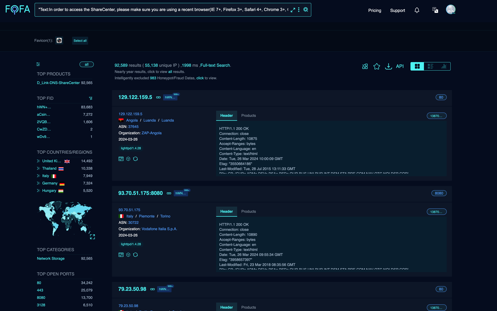
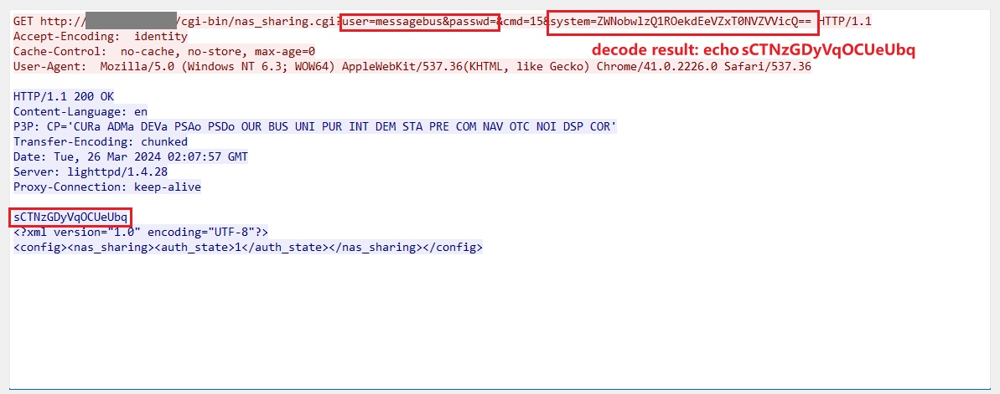

# Command Injection and Backdoor Account in D-Link NAS Devices

## **Vulnerability Summary:**

The described vulnerability affects multiple D-Link NAS devices, including models DNS-340L, DNS-320L, DNS-327L, and DNS-325, among others. The vulnerability lies within the **`nas_sharing.cgi`** uri, which is vulnerable due to two main issues: a backdoor facilitated by hardcoded credentials, and a command injection vulnerability via the **`system`** parameter. This exploitation could lead to arbitrary command execution on the affected D-Link NAS devices, granting attackers potential access to sensitive information, system configuration alteration, or denial of service, by specifying a command,Affecting over 92,000 devices on the Internet.



## Corresponding CWE

CWE-77 (Command Injection) and CWE-798 (Use of Hard-coded Credentials).

## Affected Devices:

- DNS-320L Version 1.11, Version 1.03.0904.2013, Version 1.01.0702.2013
- DNS-325 Version 1.01
- DNS-327L Version 1.09, Version 1.00.0409.2013
- DNS-340L Version 1.08

## Vulnerability Details:

The vulnerability exists in the `nas_sharing.cgi` CGI script, which leads to:

1. **Backdoor through Username and Password Exposure**: The request includes parameters for a username (**`user=messagebus`**) and an empty password field (**`passwd=`**). This indicates a backdoor allowing unauthorized access without proper authentication.
2. **Command Injection through the System Parameter**: The **`system`** parameter within the request carries a base64 encoded value that, when decoded, appears to be a command.

## Exploitation:

Craft Malicious HTTP Request: Prepare an HTTP GET request targeting the `/cgi-bin/nas_sharing.cgi` endpoint.

```
GET /cgi-bin/nas_sharing.cgi?user=messagebus&passwd=&cmd=15&system=<BASE64_ENCODED_COMMAND_TO_BE_EXECUTED>
```

## **Actual Result**



## Impact:

Successful exploitation of this vulnerability could allow an attacker to execute arbitrary commands on the system, potentially leading to unauthorized access to sensitive information, modification of system configurations, or denial of service conditions.

## **Fix Recommendation:**

- Apply available patches and updates from the device manufacturer.
